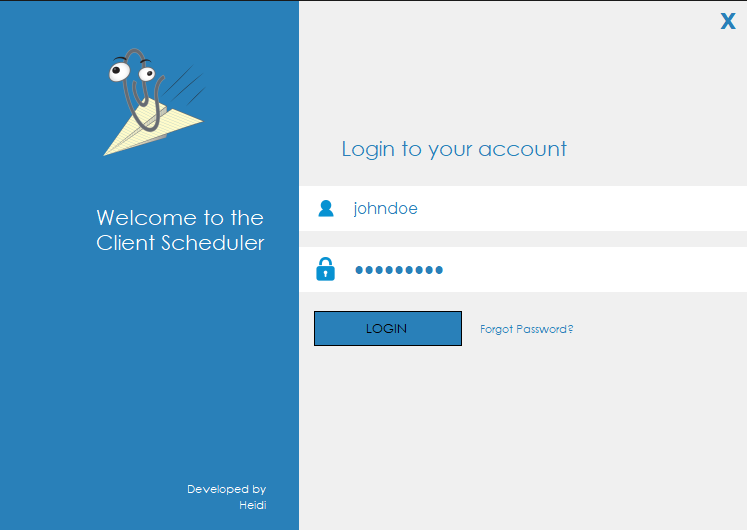

# Client Scheduler

Winforms .NET application  
_Object-Oriented Application Development with Advanced C# C969 WGU_

- Uses Entity Framework to reverse-engineer a provided database schema in order to scaffold entity type classes and a DbContext class.

## Assumptions and Notes
- The username is always "test" and the password is always "test".
- The language localization for the login is English and German, and German will be used when the computer's region is Germany. (To switch, search "Region" in the windows search bar and open control panel, change to Germany).
- A customer is marked "active" if they have had any appointments in the last 6 months or scheduled in the next 6 months.

## Login Form

